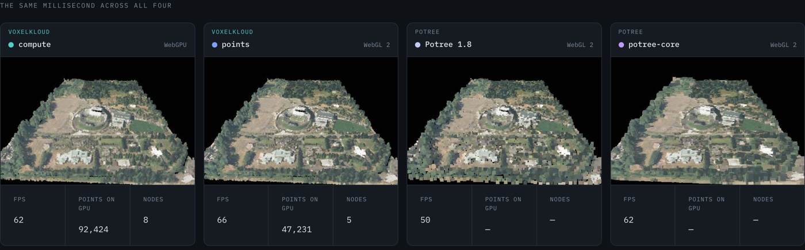

# @voxelkloud/view

WebGPU point cloud renderer on three.js, consuming
[@voxelkloud/loader](../loader/README.md) streams.

```sh
npm install @voxelkloud/view @voxelkloud/loader three
```

```ts
import { loadHierarchy, loadPointCloudSource } from "@voxelkloud/loader";
import { createPointCloudView } from "@voxelkloud/view";

const source = await loadPointCloudSource(url);
const hierarchy = await loadHierarchy(source);
await hierarchy.expandAll();

const view = createPointCloudView({ canvas });
await view.init();
view.addCloud(source, hierarchy);
view.frameCloud();
view.setSize(canvas.clientWidth, canvas.clientHeight, devicePixelRatio);

const tick = () => {
  requestAnimationFrame(tick);
  view.renderFrame();
};
tick();
```

`view.camera` and `view.scene` are the three objects, so OrbitControls and every
other add-on attach normally.

### A cloud you can point it at right now

```ts
const url = "https://s3.amazonaws.com/hobu-lidar/autzen-classified.copc.laz";
```

One COPC file on a bucket that is not ours, read by HTTP Range with no
conversion step and nothing downloaded whole. Verified from a browser rather
than assumed: it answers the CORS preflight for a ranged `GET` with
`Access-Control-Allow-Headers: range`, which is the part most public buckets
get wrong.

USGS 3DEP is the obvious bigger example — the whole United States, as EPT, and
genuinely public. It does not work from a page: plain `GET`s succeed, and the
preflight for a ranged one returns **403**. `curl` will tell you the data is
fine and the browser will still refuse it, so check the preflight before
promising anyone a dataset.

## Three rasterisers

`sinkMode` picks how points reach the screen. The default is `"auto"`, which
resolves in order: **compute** on WebGPU, **points** on WebGL 2, and the
instanced arena only if neither is reachable. `view.rasterizer` reports which
won, so a caller can see a fallback instead of inferring it from a frame time.

```ts
createPointCloudView({ canvas, sinkMode: "arena" }); // pin the instanced path
```

**Compute** software-rasterises in three passes — `atomicMin` the depth,
`atomicAdd` the colour and a weight, then a fullscreen resolve that averages.
One invocation per point: no instancing, no quad envelope, no per-instance
attribute step.

**Points** draws `gl.POINTS` with a real `gl_PointSize` on WebGL 2 — what Potree
does, and what WGSL cannot express. It is unreachable through three's node
system, whose GLSL builder writes `gl_PointSize = 1.0` after our code, so this
path owns its draw too.

**Instanced** draws a view-aligned quad per point through three. NOT `Points`:
three's WebGPU backend maps `object.isPoints` to `point-list` topology and WGSL
has no point-size builtin, so `sizeNode` is silently ignored there and every
point rasterises as one pixel with no attenuation.

### The instanced path is for COMPOSITION now, not performance

It is the slowest of the three and it is not going away, because it is the only
one that draws through three's scene graph. Compute and points both own their
draw, which is what makes them fast and also what stops them composing: a gizmo,
a mesh, an overlay that has to occlude and be occluded by the cloud only works
on the instanced path. Pick it deliberately with `sinkMode: "arena"` when a
scene needs that; the other two are for when the cloud IS the scene.

### Why compute is the default

Measured on autzen at a 3M budget, same camera, same selected points, runs with
a contaminated main thread discarded:

| | backend | INP | idle fps |
| --- | --- | --- | --- |
| **compute** | WebGPU | **72 ms** | 59.9 |
| **points** | WebGL 2 | **72 ms** | 59.9 |
| Potree 1.8, for scale | WebGL | 88 ms | 59.9 |
| instanced | WebGPU | 272–320 ms | 59.9 |
| instanced | WebGL 2 | 656 ms | 7.5 |

The cost the instanced path cannot shed is per INSTANCE — the attribute step for
`pointOffset`, `color` and `scalarValue`, once per splat — and that was found by
elimination rather than guessed: pinning the splat to 1 px left INP unchanged
(so not fill rate), a 3-vertex envelope left it unchanged (so not per-vertex),
and a sweep showed INP linear in instance count.

### Watch them load, frame by frame

[**Convergence race →**](https://voxelkloud.github.io/#measurements)

[](https://voxelkloud.github.io/#measurements)

One slider, four renderers, the same millisecond. Drag it and every panel jumps
together, so what you compare is the picture each one had at that moment rather
than four frames chosen independently.

Captured at 480x320 over a throttled 2.5 MB/s link with the HTTP cache off, all
four given a byte-identical camera — eye and direction agree to the last decimal
place, which is checked before a run rather than assumed:

| | first ink | half way | settled | fps |
| --- | --- | --- | --- | --- |
| **compute** (WebGPU) | **436 ms** | 881 ms | 10.4 s | 59.9 |
| potree-core | 479 ms | 920 ms | 13.4 s | 41.9 |
| **points** (WebGL 2) | 586 ms | **843 ms** | **9.9 s** | 59.9 |
| Potree 1.8 | 1286 ms | 1655 ms | 13.7 s | 59.9 |

Half way — when a renderer has closed half the distance to its own final frame,
which is roughly when the scene stops looking wrong — separates them more than
settling does, and settling separates them least of all: that column is a
sanity check, not a podium.

Distance is measured against each arm's OWN final frame, never against another's.
Comparing one renderer's pixels to another's would measure visual character
rather than convergence — compute is smooth by construction and points is
grainy, and neither is lateness.

The page carries its own caveats, including why the Potree arms report no
resident point count and why a frame rate that lands on exactly 30.0 or 50.0 is
the machine rather than the renderer.

Both paths share the LOD scheduler, the octree cut, the six colour modes, EDL
and `pickPoint`, and both size a splat with the same numbers. What differs is
what happens after the point is chosen.

Colour modes: `rgb`, `elevation`, `level`, `intensity`, `classification`,
`flat`. The two scalar modes select a different decode layout, so they are set
when the view is built rather than toggled.

Eye-dome lighting via `edl: { strength, radius, opacity }`, using Potree's
constants so an `edlStrength` transfers unchanged. Off by default.

Splat size comes from the LOCAL depth of the selection, not from the level of
the node a point came from. Each point walks the selected octree cut in the
vertex stage down to the finest node that has landed at its own position, and
sizes itself to that pitch — so the coarse layers that sit under a refined
region draw at the refined pitch instead of `2**(D-L)` too wide and painting
over data that is already on the GPU.

The point budget is spent in two tiers. Refinement up to `targetScreenError` is
what the caller asked for and may spend the whole `pointBudget`; refinement past
it is opportunistic, runs at most `BONUS_LEVELS` (2) octree levels deeper, and
may only spend down to `pointBudget * (1 - budgetHeadroom)` — 15% by default,
left free so the next camera move can grow into it without evicting.

`stats.limitedBy` is the field the reference viewer lacks. `"error"` means the
target was met and the bonus tier ran out of detail to add; `"headroom"` means
it was met and the bonus tier hit the withheld slice; `"budget"` and `"nodes"`
mean the target was NOT met and quality is being left on the table. Read it with
`stats.achievedScreenError`, the worst projected error still on screen.

### `@voxelkloud/view/lod`

The scheduler on its own — frustum extraction, AABB classification, the
screen-space-error metric, best-first selection — behind a subpath whose module
graph pulls in no three, no DOM and no GPU. Allocation-free in steady state.

Full documentation: [voxelkloud](../../README.md).

MIT.
